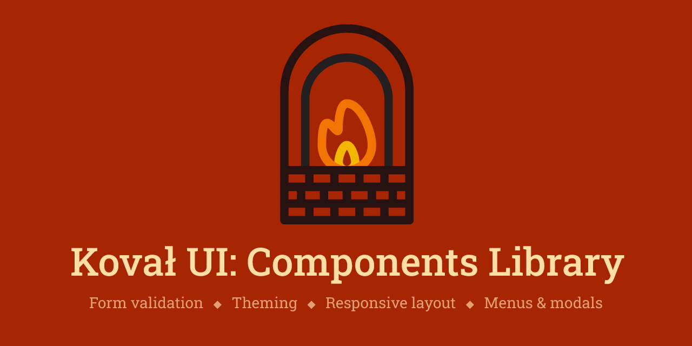

# Forge React components library

Visit [Demo Storybook](https://morewings.github.io/react-library-template/).

## Features

- Supports **Typescript** and **Javascript**.

## Quickstart

### Installation

### Add styles

