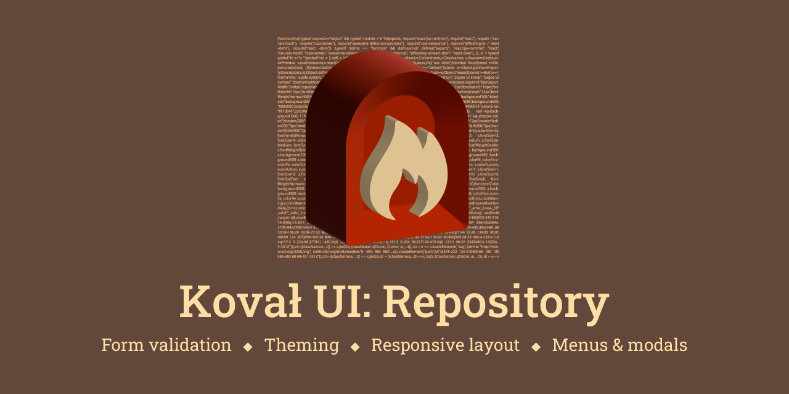

[](https://github.com/morewings/koval-ui/actions/workflows/pages.yml)
[](https://github.com/morewings/koval-ui/actions/workflows/merge-jobs.yml)
[](https://github.com/morewings/koval-ui)
[](https://www.npmjs.com/package/koval-ui)
[](https://www.npmcharts.com/compare/koval-ui?interval=7)
[](https://bundlejs.com/?bundle&q=koval-ui@latest&config={"analysis":"treemap","esbuild":{"external":["react","react-dom"]}})
[](https://codeclimate.com/github/morewings/koval-ui/maintainability)
[](https://codeclimate.com/github/morewings/koval-ui/test_coverage)

# Koval components library

[](#)

Koval UI: A modern React component library designed for experimentation & performance. Koval UI provides a comprehensive set of components (layout, various inputs, form, data table and carousel), all built with native browser APIs at their core. This approach minimizes JavaScript overhead, improving stable performance and reducing bundle size. Ideal for developers building cutting-edge applications, AI interfaces, or rapidly prototyping new ideas. 

Explore Koval UI and accelerate your next project!

## Features

- Supports **Typescript**, bundled types.
- **ESM** and **commonjs** bundles.
- Compatible with **Nextjs**.
- CSS Flex column-based layout.
- Inputs compatible with **react-hook-form** and similar libraries.
- Built-in form validation.
- Typography components.

Read [Koval docs](https://koval.support/)

See [Koval Storybook](https://morewings.github.io/koval-ui/).

<a href="https://www.producthunt.com/posts/koval-ui?embed=true&utm_source=badge-featured&utm_medium=badge&utm_souce=badge-koval&#0045;ui" target="_blank"></a>

## Quickstart

Install library with the package manager of your choice

```bash
npm i koval-ui
```

Include Koval css styles and wrap your application with Provider.

```jsx
import {Provider} from 'koval-ui';
import 'koval-ui/dist/index.css';

const App = ({children}) => {
    //...
    return <Provider>{children}</Provider>
}
```

## Acknowledgments


This project is developed using amazing **Webstorm IDE** provided by [Jetbrains](https://www.jetbrains.com).


